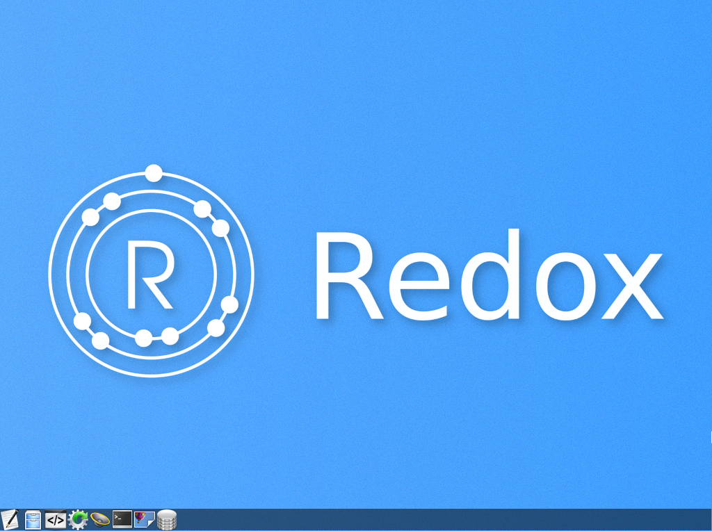
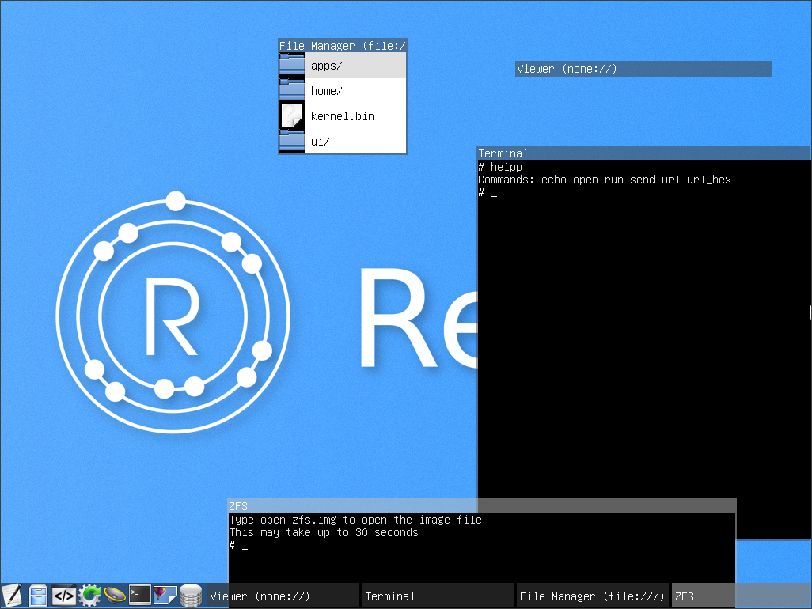
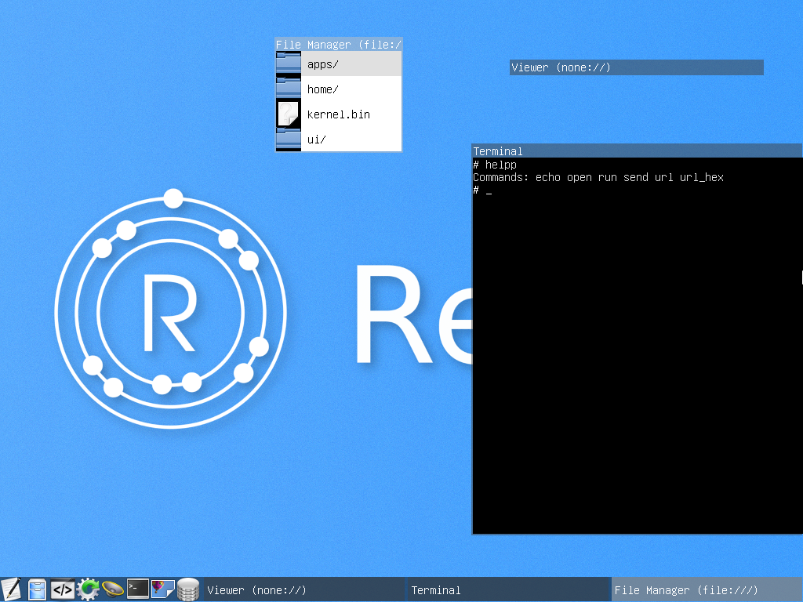
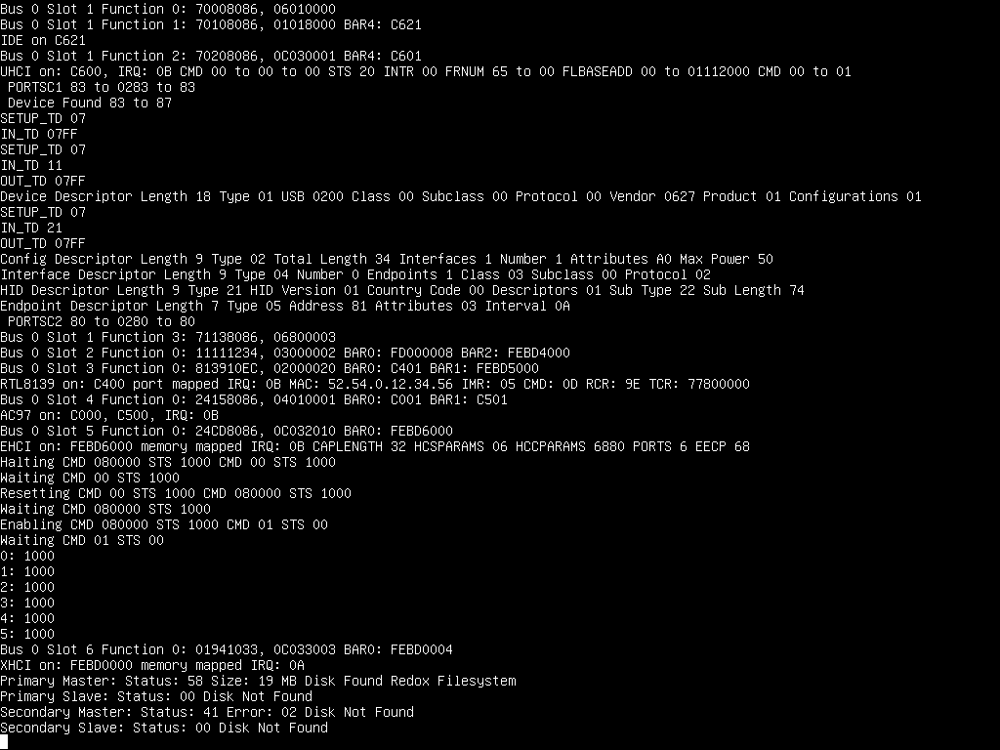

**Redox** is a Rust based operating system, designed to be modular and secure. The developer blog can be found at https://redox-os.org

## What it looks like






## Building on Debian/Ubuntu
- Run the setup script and enter your password when prompted (to install Rust compiler and its dependencies)
```bash
cd setup
./ubuntu.sh
./binary.sh
```
- Make the project
```bash
make all
```

## Running on Debian/Ubuntu
- Install VirtualBox
```bash
sudo apt-get install virtualbox
```
- Run VirtualBox
```bash
make virtualbox
```

## Running on Debian/Ubuntu (Qemu, Advanced)
- Install Qemu
```bash
sudo apt-get install qemu-system-x86 qemu-kvm uml-utilities
```
- Run Qemu
```bash
make qemu_tap
```
## Building on Arch Linux
- Run the setup script and enter your password when prompted (to install the Rust compiler and its dependencies)
```bash
cd setup
./arch.sh
./binary.sh
```
- Make the project
```bash
make
```
## Running on Arch Linux
- Virtualbox was completely setup as part of the script.
- Run Virtualbox
```bash
make virtualbox
```


## Running on Arch Linux (Qemu)

- Install Qemu
```bash
$ sudo pacman -S qemu
```
- Run redox
```bash
$ make qemu_tap
```

## Building on Fedora
- Run the setup script and enter your password when prompted (to install Rust compiler and its dependencies)
```bash
cd setup
./fedora.sh
./binary.sh
```
- Make the project
```bash
make all
```
## Running on Fedora (Qemu, Advanced)
- Install Qemu
```bash
sudo yum install qemu-system-x86 qemu-kvm tunctl
```
- Run Qemu
```bash
make qemu_tap
```

## Building on OS X
- Install MacPorts or Homebrew
- Run the setup script and enter your password when prompted (to install Rust compiler and its dependencies)
```bash
cd setup
# MacPorts
./osx-macports.sh
# Homebrew
./osx-homebrew.sh
./binary.sh
```
- Make the project
```bash
make all
```

## Running on OS X
- Install VirtualBox from https://www.virtualbox.org/wiki/Downloads
- Make sure it is installed for all users, in /Applications/ or edit the Makefile VBM path
- Run VirtualBox
```bash
make virtualbox
```

## Building on Windows
- Download and install the latest 32-bit Rust nightly from http://www.rust-lang.org/install.html
- The direct link to the 32-bit nightly is https://static.rust-lang.org/dist/rust-nightly-i686-pc-windows-gnu.msi
- Open the Rust nightly shell in the redox repository
```bash
windows\make all
```

## Running on Windows
- Install VirtualBox from https://www.virtualbox.org/wiki/Downloads
- Make sure to install to C:\Program Files\Oracle\VirtualBox or edit the Makefile VBM path
- Run VirtualBox
```bash
windows\make virtualbox
```
