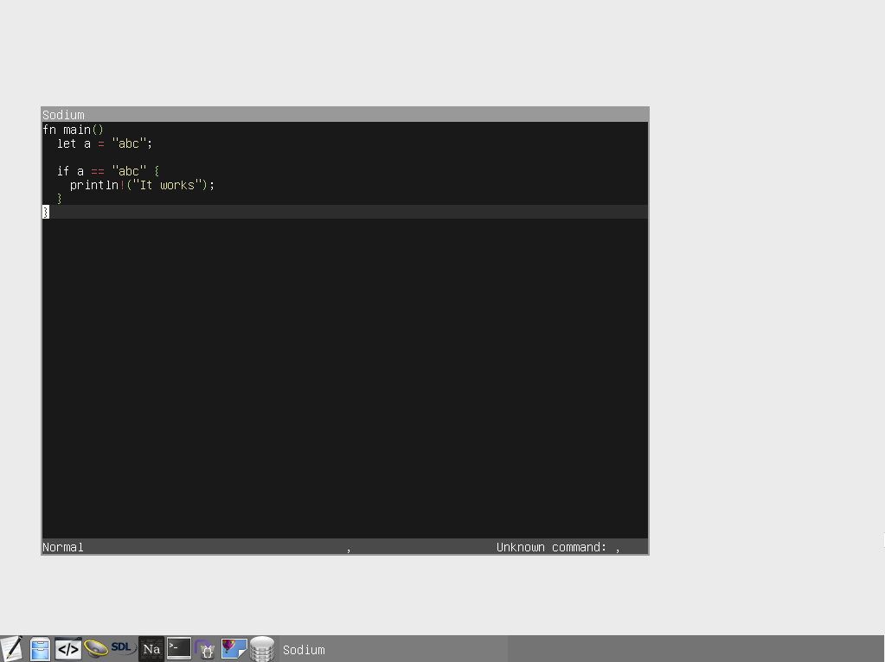
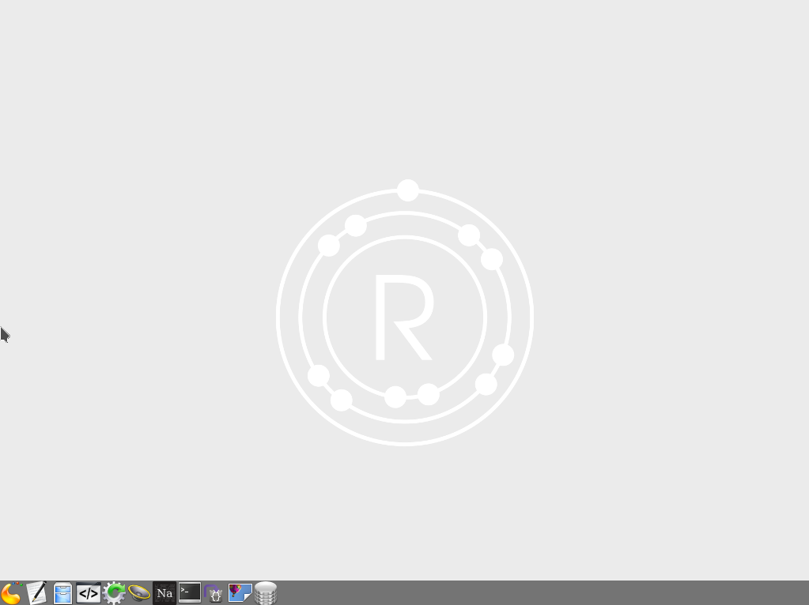

**Redox** is an operating system written in pure Rust, designed to be modular and secure. The development blog can be found at http://www.redox-os.org.

Documentation can be found [here](http://ticki.github.io/redocs/redox/).

Please make sure you use the **latest nightly** of `rustc` before building (for more troubleshooting, see ["Help! Redox won't compile!"](#compile-help)).


[](./LICENSE.md)

## Contents

* [What it looks like](#what-it-looks-like)
* [Help! Redox won't compile](#compile-help)
* [Contributing to Redox](#contributing)
* [Cloning, Building and running](#cloning-building-running)
 * [Quick Setup](#quick-setup)
 * [Manual Setup](#manual-setup)


## <a name="what-it-looks-like" /> What it looks like






## <a name="compile-help" /> Help! Redox won't compile!

Sometimes things go wrong when compiling. Try the following before opening an issue:

1. Run `make clean`.
2. Run `git clean -X -f -d`.
3. Make sure you have **the latest version of Rust nightly!** ([multirust](https://github.com/brson/multirust) is recommended for managing Rust versions).
4. Update **GNU Make**, **NASM** and **QEMU/VirtualBox**.
5. Pull the upstream master branch (`git remote add upstream git@github.com:redox-os/redox.git; git pull upstream master`).

and then rebuild!

## <a name="contributing" /> Contributing to Redox

If you're interested in this project, and you'd like to help us out, [here](CONTRIBUTING.md) is a list of ways you can do just that.

## <a name="cloning-building-running" /> Cloning, Building, and Running

### <a name="quick-setup" /> Quick Setup

```bash
$ cd path/to/your/projects/folder/

# Run bootstrap setup
$ curl -sf https://raw.githubusercontent.com/redox-os/redox/master/bootstrap.sh -o bootstrap.sh && bash -e bootstrap.sh

# Build Redox
$ make all

# Launch using VirtualBox
$ make virtualbox

# Launch using QEMU
$ make qemu
# Launch using QEMU without using KVM (Kernel Virtual Machine). Try if QEMU gives an error.
$ make qemu kvm=no
```

### <a name="manual-setup" /> Manual Setup

To manually clone, build and run Redox using a Linux host, run the following commands (with exceptions, be sure to read the comments):
```bash
$ cd path/to/your/projects/folder/

# HTTPS
$ git clone https://github.com/redox-os/redox.git --origin upstream --recursive
# SSH
$ git clone git@github.com:redox-os/redox.git --origin upstream --recursive

$ cd redox/

# Install/update dependencies
$ sudo <your package manager> install llvm make nasm virtualbox virtualbox-dkms qemu qemu-kvm

# Install multirust
$ curl -sf https://raw.githubusercontent.com/brson/multirust/master/blastoff.sh | sh

# Set override toolchain to nightly build
$ multirust override nightly

# Build Redox
$ make all

# Launch using VirtualBox
$ make virtualbox

# Launch using QEMU
$ make qemu
# Launch using QEMU without using KVM (Kernel Virtual Machine). Try if QEMU gives an error.
$ make qemu kvm=no
```
