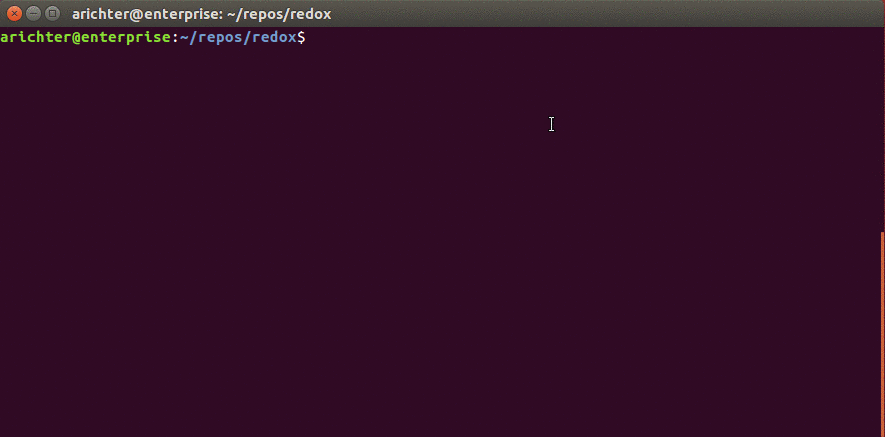

## Building Redox using a Docker image with the pre-built toolchain

*All you need is `git`, `make`, `qemu`, `fuse` and `docker`. The method requires
a non-privileged user able to run the `docker` command, which is usually achieved
by adding the user to the `docker` group.*

It's a three-steps process with variations depending on the platform.
On the first execution of one of the following docker commands, the
official container image will be pulled from dockerhub and stored
locally.

The image includes the required dependencies and the pre-built
toolchain. As long as you rely on this particular dependencies and
toolchain versions, you don't need to update the container.

### <a name='get_the_sources'></a>Get the sources
```
git clone https://gitlab.redox-os.org/redox-os/redox.git ; cd redox
```

### Update the source tree
Note: if you use the container on a different host or
with a different user, [get the sources first](#get_the_sources).
```shell
git pull --rebase --recurse-submodules && git submodule sync \
    && git submodule update --recursive --init
```

### Run the container to build Redox
```shell
docker run --cap-add MKNOD --cap-add SYS_ADMIN --device /dev/fuse \
    -e LOCAL_UID="$(id -u)" -e LOCAL_GID="$(id -g)" \
    -v redox-"$(id -u)-$(id -g)"-cargo:/usr/local/cargo \
    -v redox-"$(id -u)-$(id -g)"-rustup:/usr/local/rustup \
    -v "$(pwd):$(pwd)" -w "$(pwd)" --rm redoxos/redox make fetch all
```
#### Linux with security modules
Add the following options depending on the security modules activated on your system:
```shell
--security-opt label=disable         // disable SELinux
--security-opt seccomp=unconfined    // disable seccomp
--security-opt apparmor=unconfined   // disable AppArmor
```
Ex.: for a SELinux only system such as Fedora or CentOS
```shell
docker run --cap-add MKNOD --cap-add SYS_ADMIN --device /dev/fuse \
    -e LOCAL_UID="$(id -u)" -e LOCAL_GID="$(id -g)" \
    --security-opt label=disable \
    -v redox-"$(id -u)-$(id -g)"-cargo:/usr/local/cargo \
    -v redox-"$(id -u)-$(id -g)"-rustup:/usr/local/rustup \
    -v "$(pwd):$(pwd)" -w "$(pwd)" --rm redoxos/redox make fetch all
```
### Run the container interactively
```shell
docker run --cap-add MKNOD --cap-add SYS_ADMIN --device /dev/fuse \
    -e LOCAL_UID="$(id -u)" -e LOCAL_GID="$(id -g)" \
    -v redox-"$(id -u)-$(id -g)"-cargo:/usr/local/cargo \
    -v redox-"$(id -u)-$(id -g)"-rustup:/usr/local/rustup \
    -v "$(pwd):$(pwd)" -w "$(pwd)" --rm -it redoxos/redox
```

#### Demo


### Clear the named volumes containing the toolchain caches
```shell
docker volume rm redox-"$(id -u)-$(id -g)"-cargo \
    redox-"$(id -u)-$(id -g)"-rustup
```

### Build the container manually
If you cannot access dockerhub for whatever reason, you can also build
the container image manually.
```shell
docker build -t redoxos/redox docker/
```

### Troubleshooting / updating
Sometimes, builds may fail because the nightly toolchain of rust inside the container got out of sync with dependencies of redox, or there are issues with cargo. In this case, it might help to update your current container image and delete the rust and cargo caches. This way, you can start over from a clean state and rule out your local setup as the origin of errors.

```shell
docker pull redoxos/redox
docker volume rm redox-"$(id -u)-$(id -g)"-cargo \
    redox-"$(id -u)-$(id -g)"-rustup
```
